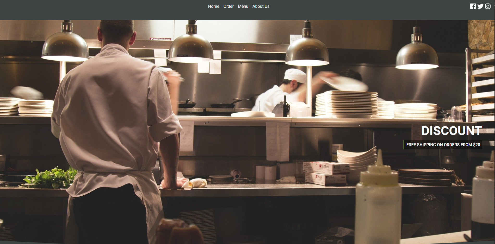
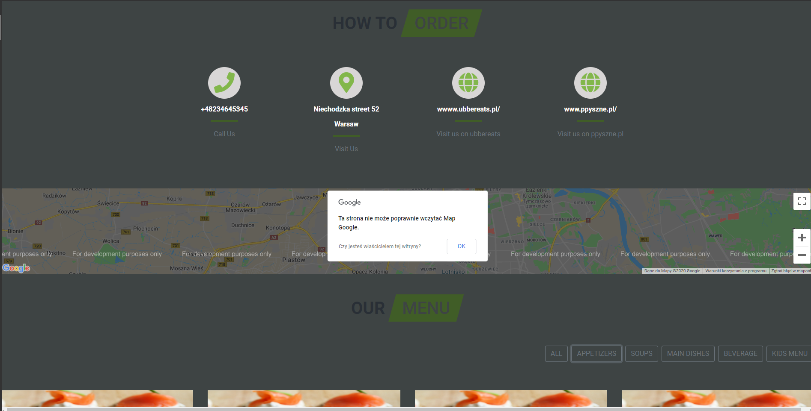
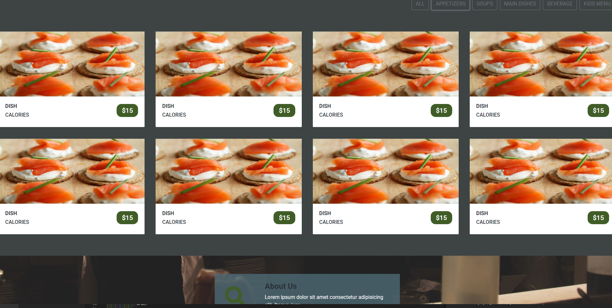

## Table of contents
* [General info](#general-info)
* [Technologies](#technologies)
* [Setup](#setup)

## General info
Simple information website with google map API,choosing methods
	
## Technologies
Project is created with:
* HTML
* Bootstrap
* Jquery
* css
	
## Setup
To run this project just download and open index.html on local server emulator (visual studio extension).

## Information
Website of resturant which contain menu choosing method and google map API , all made in bootstrap.

## Screen shots

